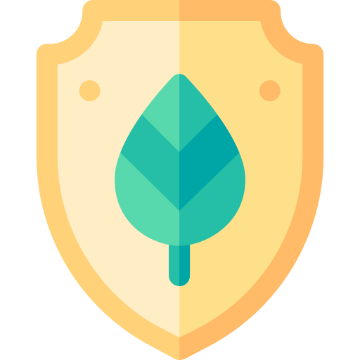
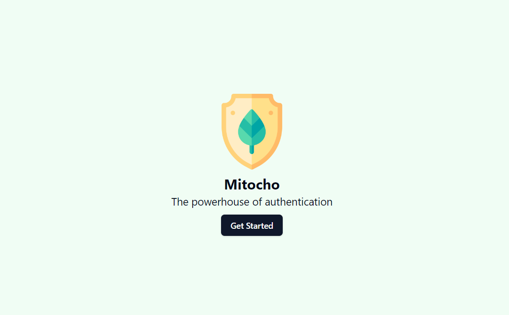

<br/>
<p align="center">
  <a href="https://github.com/yzaimoglu/mitocho">
    
  </a>

  <h3 align="center">Mitocho</h3>

  <p align="center">
    The powerhouse of automation
    <br/>
    <br/>
    <a href="https://github.com/yzaimoglu/mitocho/issues">Report Bug</a>
    .
    <a href="https://github.com/yzaimoglu/mitocho/issues">Request Feature</a>
  </p>
</p>

    

## Table Of Contents

* [About the Project](#about-the-project)
* [Built With](#built-with)
* [Getting Started](#getting-started)
  * [Prerequisites](#prerequisites)
* [Usage](#usage)
* [Roadmap](#roadmap)
* [Contributing](#contributing)
* [License](#license)
* [Acknowledgements](#acknowledgements)

## About The Project



# Authentication Project README

Creating secure, efficient, and scalable authentication and authorization solutions from scratch can be a daunting and time-consuming task for developers. Recognizing this challenge, we've developed an authentication project designed to significantly simplify the integration of authentication and authorization mechanisms into your applications. This project is born out of the realization that developers spend an excessive amount of time reinventing the wheel for authentication flows, which detracts from focusing on the unique aspects of their own projects.

Here's why this authentication project is a game-changer for your development workflow:

* **Focus on Building Unique Features:** Spend more time developing the core features that make your project stand out. Leave the complex and critical task of implementing secure authentication to us.
* **Avoid Repetitive Work:** Stop writing authentication codes from scratch for every new project. Our solution provides a robust, flexible foundation that can be easily integrated and customized for a wide range of applications.
* **Embrace DRY Principles:** Just like adhering to DRY (Don't Repeat Yourself) principles in your coding practices, applying the same philosophy to your project's authentication process can save time, reduce errors, and improve maintainability.

While we strive to make our authentication project as versatile as possible, we understand that no single solution can cater to every possible requirement. Therefore, we're committed to continuously evolving our project based on community feedback. You're encouraged to contribute by forking our repository, submitting pull requests, or opening issues to suggest improvements or new features.

In the near future, we plan to expand our project's capabilities to cover more authentication and authorization scenarios, ensuring it remains the most comprehensive and developer-friendly solution available.

## Built With

We are using Go, Templ, Tailwind and Flowbite for the web application, MySQL for the Database and Redis as a Cache.

## Getting Started

This is an example of how you may give instructions on setting up your project locally.
To get a local copy up and running follow these simple example steps.

### Prerequisites

This is an example of how to list things you need to use the software and how to install them.

* make
* go 
* npm
* templ
* air

```sh
Installation instructions will follow
```

## Usage

Use this space to show useful examples of how a project can be used. Additional screenshots, code examples and demos work well in this space. You may also link to more resources.

_For more examples, please refer to the [Documentation](https://example.com)_

## Roadmap

See the [open issues](https://github.com/yzaimoglu/mitocho/issues) for a list of proposed features (and known issues).

## Contributing

We appreciate everyone who wants to contribute. In order to do so take a look at the issues tab and work on one of the issues. You can then create a pull request:

### Creating A Pull Request

1. Fork the Project
2. Create your Feature Branch (`git checkout -b feature/AmazingFeature`)
3. Commit your Changes (`git commit -m 'Add some AmazingFeature'`)
4. Push to the Branch (`git push origin feature/AmazingFeature`)
5. Open a Pull Request

## License

Distributed under the BSD-3 License. See [LICENSE](https://github.com/yzaimoglu/mitocho/blob/main/LICENSE.md) for more information.

## Acknowledgements

* [FlatIcon](https://www.flaticon.com/)
